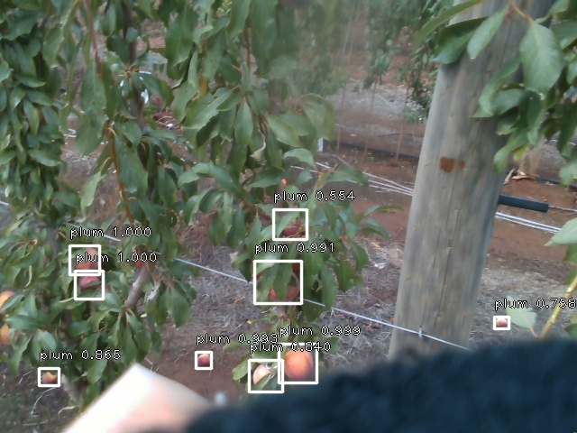
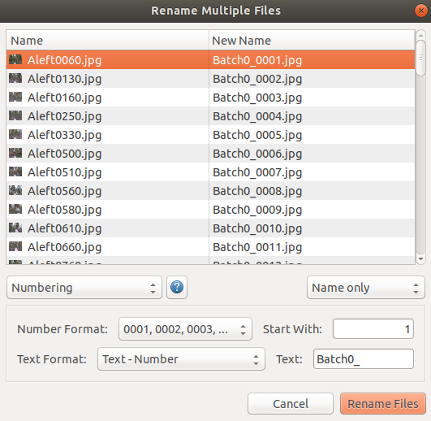

# Retinanet-Tutorial
This is a tutorial created for the sole purpose of helping you quickly and easily train an object detector for your own dataset. It is an improvement over my [previous tutorial](https://github.com/jaspereb/FasterRCNNTutorial) which used the now outdated FasterRCNN network and tensorflow. This tutorial makes use of keras, tensorflow and tensorboard. There is a video version of this tutorial available here: https://youtu.be/mr8Y_Nuxciw where I go through the entire training process, so consult that if you get stuck.

It is based on the excellent [keras-retinanet](https://github.com/fizyr/keras-retinanet) implementation by fizyr which you should definitely read if you have time. This includes a sample dataset of images of plums but is intended to help you train your on your own dataset. This is a step which is often not well documented and can easily trip up new developers with specific data formatting requirements that aren't at all obvious.

The fizyr implementation we will be using has several data formatting options (and you could even write your own). The CSV input format is probably the easiest to understand and generate, BUT it's non standard and if you ever want to use a different network you would need to convert it. Because of that, we will be using the Pascal VOC 2007 format for our data. Then if you need it in the future, there are tools to easily convert to other formats (like COCO).

# ROS?
ROS is the Robot Operating System. Included in this repository is a ROS node to run the detector as part of a robot perception system. Even if you don't have a robot, ROS drivers exist for most types of cameras so this is an easy way to get live data streams and inference results set up. If you only care about inferencing a single image just use the testDetector.py script. If you would like to use the ROS node, see USING_ROS.md in the ROS-Node folder. 

# Should I use this tutorial?
This tutorial is aimed at people who don't have a lot of experience with linux or machine learning. If you only have a passing acquaintance with bash, or care more about getting something to work than understanding the mechanisms behind it, then this is the tutorial for you. You should be able to follow the steps in the video exactly, and get a result that works. 

This is only for linux users, everything will be in Ubuntu using an Nvidia GPU. 

# Installation
The first issues that most deep learning practicioners run into are installation errors, so here's some brief advice on installing stuff. 

Most errors come from version mismatches, so make sure you get this right the first time, it's much faster to just downgrade a component than to assume a higher version will work. The key components you need to install are Nvidia drivers, CUDA, CUDNN, tensorflow, keras and a bunch of python libraries. While you can run this without a GPU, it's so slow that it's not worth it. I will use python2 for everything but python3 should work just fine.

* NVIDIA Drivers. These are a massive pain in Ubuntu and can easily leave you with a broken OS if you do it wrong. The most reliable method I have found is to download the most recent driver version from https://www.nvidia.com/Download/index.aspx. This will give you a file like `NVIDIA-Linux-x86_64-440.82.run`. You want to close x server in order to install it (this command will drop you into terminal only mode, no graphics, so have these instructions on a separate computer!), to do this press `CTRL+ALT+F1` or `CTRL+ALT+F2` then run

`sudo service lightdm stop`

`sudo init 3`

`cd ~/Downloads`

`sudo chmod +x [Your Driver .run File]`

`sudo ./[Your Driver .run File]`

* CUDA 10.0. Download this from https://developer.nvidia.com/cuda-10.0-download-archive and the steps to install it are quite similar to that of the driver. **Do not let it install the Nvidia driver when it asks to** only install CUDA.

`CTRL+ALT+F1` or `CTRL+ALT+F2`

`sudo service lightdm stop`

`sudo init 3`

`cd ~/Downloads`

`sudo chmod +x [Your CUDA .run File]`

`sudo ./[Your CUDA .run File]`

`sudo reboot now`

* CUDNN for CUDA 10.0. You need an NVIDIA account to get this download from https://developer.nvidia.com/rdp/form/cudnn-download-survey. Get whatever the lastest version for CUDA 10.0 is. This will give you a .tgz file, unzip and install it using

`cd ~/Downloads`

`tar -xzvf [Your CUDNN .tgz File]`

`sudo cp cuda/include/cudnn.h /usr/local/cuda/include`

`sudo cp cuda/lib64/libcudnn* /usr/local/cuda/lib64`

`sudo chmod a+r /usr/local/cuda/include/cudnn.h /usr/local/cuda/lib64/libcudnn*`

* Tensorflow 1

`pip install --user --upgrade tensorflow-gpu`

* Keras (not tensorflow-keras)

`sudo pip install keras`

# Getting the tools
Run

`mkdir ~/RetinanetTutorial`

`cd ~/RetinanetTutorial`

then download the following (you should have a [github SSH key](https://help.github.com/en/enterprise/2.17/user/github/authenticating-to-github/generating-a-new-ssh-key-and-adding-it-to-the-ssh-agent) setup already) 

* This repo `git clone https://github.com/jaspereb/Retinanet-Tutorial.git`

* The keras-retinanet repo `git clone git@github.com:fizyr/keras-retinanet.git`

* The labelimg tool `git clone git@github.com:tzutalin/labelImg.git`

# Creating the dataset
The first step to creating your dataset is to pick the format you want to use, we will go with Pascal VOC 2007 here, but you could also use the CSV format or COCO. 

There are 3 folders in the Pascal VOC format, JPEGImages, Annotations (which has .xml files) and ImageSets/Main (which has .txt files listing the data). 

## Making JPEGImages
I will be starting from a folder of JPEG images extracted randomly from a video stream. The first step is to cull them down to a manageable number (15 for our simple demonstration). When selecting images to add to the dataset we are looking for ones which are diverse, clear, easy to label and not blurry or obscured. 

Make the data directory
`mkdir ~/RetinanetTutorial/Data`

Select 15 of the images in `~/RetinanetTutorial/Raw_Data` and copy these into the data directory called `~/RetinanetTutorial/Data`. 

The names will all be out of order, and while it's not actually neccessary I like to batch rename them at this point which can save a lot of time in future if you need to combine datasets. Do this using the thunar tool.

`sudo apt-get install thunar`

`cd ~/RetinanetTutorial/Data`

`thunar`

Then `CTRL-a` to select everything, right click on one image and select rename, you should get a window like the following:

Make sure the settings at the bottom are as shown, then click Rename Files. If you add data in future, increase the Batch#_ number and you can just copy the new files into the VOC folders. Now close thunar.

Once the JPG files are renamed we can set up the final VOC folder structure and move them into it using

`mkdir -p ~/RetinanetTutorial/PlumsVOC/JPEGImages`

`mkdir ~/RetinanetTutorial/PlumsVOC/Annotations`

`mkdir -p ~/RetinanetTutorial/PlumsVOC/ImageSets/Main`

`cp ~/RetinanetTutorial/Data/* ~/RetinanetTutorial/PlumsVOC/JPEGImages`

## Labelling
To make the Annotations folder we will use the `labelimg` tool. You have already git cloned that so you should be able to run

`cd ~/RetinanetTutorial/labelImg`

`sudo apt-get install pyqt5-dev-tools`

`sudo pip3 install -r requirements/requirements-linux-python3.txt`

`make qt5py3`

`python3 labelImg.py`

Make sure to tick the `View > Auto Save Mode checkbox` then click `Open Dir` and set it to `~/RetinanetTutorial/PlumsVOC/JPEGImages`, `Change Save Dir` and set it to `~/RetinanetTutorial/PlumsVOC/Annotations`. Ensure PascalVOC is selected under </> and then click `Create\nRectBox`. Tick the `Use Default Label` box on the right and type `redPlum` beside it. 

We're going to add a 2nd class just for fun, so label some of the plums as 'greenPlum' by changing the text in default label before labelling them. Don't forget to change it back to redPlum for most of the examples. 

Now you can start labelling! The W key adds a new bounding box, you can select and delete them using the list on the right. You can also zoom with `CTRL-Scroll` and can grab the bounding box corners to adjust them. Click `Next Image` when you are done labelling each one and you should see .xml files start to appear in the `Annotations` folder. When you get to the last image, make sure to manually save it by clicking the `Save` button.

Go through and label every image in the `JPEGImages` folder. If you don't want to do labelling, you can extract the PlumsVOC.zip sample dataset from this repo and use that instead, you will still need to do the 'Making ImageSets' step. 

## Making ImageSets
The `ImageSets/Main` folder needs to contain 3 files. `trainval.txt` lists every JPEGImages file without the extension, there will already be an xml file in `Annotations` with the same name as every JPG file. `train.txt` is a subset of `trainval.txt` with all the images you want to train on. `val.txt` is a subset of `trainval.txt` with all the images you want to test (validate) on. There should be no overlap between `train` and `val`. 

To make these:

`cd ~/RetinanetTutorial/PlumsVOC/ImageSets/Main`

`ls ../../JPEGImages/ > trainval.txt`

`sed -i 's/.jpg//g' trainval.txt`

`touch val.txt`

`cp trainval.txt train.txt`

Then open both `train.txt` and `val.txt` side by side. Cut and paste entries from train into test. The split should be around 60% of the total files in `train.txt` and the rest in `val.txt`.

You have now created a Pascal VOC format dataset for object detection. 

# Setting up training
To setup and run training use the commands

`mkdir -p ~/RetinanetTutorial/TrainingOutput/snapshots` 

`cd ~/RetinanetTutorial/keras-retinanet/`

We need to change the data generator which currently expects the default Pascal VOC classes so run 

`gedit keras_retinanet/preprocessing/pascal_voc.py`

and change from line 30 onwards so that it looks like

    voc_classes = {
        'redPlum'        : 0,
        'greenPlum'      : 1
    }

save and close that file.

Now we are going to build the keras-retinanet tutorial so we can use it

`cd ~/RetinanetTutorial/keras-retinanet/`

`pip install numpy --user`

we are going to system install it, so that our test script can run from anywhere, if you don't want to use `testDetector.py` you can skip this

`pip install . --user`

then also build the local copy because we will use that for training it

`python setup.py build_ext --inplace`

then finally, we are ready to start training 

`keras_retinanet/bin/train.py --tensorboard-dir ~/RetinanetTutorial/TrainingOutput --snapshot-path ~/RetinanetTutorial/TrainingOutput/snapshots --random-transform --steps 100 pascal ~/RetinanetTutorial/PlumsVOC`

we are running with a very small steps value so that you can see the model progress on tensorboard after not many steps. The default value is 10000 and using such as small value will result in creating many snapshot files in `~/RetinanetTutorial/TrainingOutput/snapshots` so you may need to delete some of the older ones as it fills up and uses a lot of disk space. If you want to train a useful model, you should set this somewhere between 2000 and 10000 depending on how big your dataset is. 

# Training
Training will likely around half an hour, depending on your hardware. You will want to open tensorboard to monitor the progress of it. You should also keep an eye on the free disk space where you are saving the model checkpoints, because this can fill up fast and crash your training. Run tensorboard in a new terminal using

`tensorboard --logdir ~/RetinanetTutorial/TrainingOutput`

then open `http://localhost:6006/` in a browser tab. 

Tensorboard stats will only show up once a validation step has been run, so initially it will say "No scalar data was found" which is normal.

One final thing to check is that the GPU is actually being used, you can do this by running 

`nvidia-smi` 

and looking at the memory usage, which should be around 90% of your GPU. If it is more like 20% there was probably a CUDA error which prevented you from using the GPU, check the messages at the top of the terminal just after you run the train.py script and look for library import errors.

Train until the tensorboard curves flatten out. 

# Deploying
Once training has finished you want to grab the best (lowest loss) model and convert this to inference mode. In the tensorboard output find the lowest point on the loss curve (don't use classification_loss by accident), this will have a step number if you mouse over it. The step index is from zero whereas the snapshots start from 1 so add 1 to the step value and find that .h5 file in the snapshots directory you set during training. Copy this file to somewhere you want to keep it then convert it to an inference model.

If the lowest step loss was step 5 the commands are 

`mkdir ~/RetinanetTutorial/RetinanetModels`

`cp ~/RetinanetTutorial/TrainingOutput/snapshots/resnet50_pascal_06.h5 ~/RetinanetTutorial/RetinanetModels/PlumsTraining.h5`

`cd ~/RetinanetTutorial/keras-retinanet/`

`keras_retinanet/bin/convert_model.py ~/RetinanetTutorial/RetinanetModels/PlumsTraining.h5 ~/RetinanetTutorial/RetinanetModels/PlumsInference.h5`

Before you can run the `testDetector.py` script you will need to set a few things in it. Open it for editing with

`cd ~/RetinanetTutorial/`

`gedit testDetector.py`

and set the paths on lines 27,28,29 to point to your new model, a test image and where to save the results. If you used a label other than `redPlum` you will need to edit line 62.

then run it using

`python ../Retinanet-Tutorial/testDetector.py`

which will by default overwrite the `plumsTest_detected.png` image in Retinanet-Tutorial with the new detections. 

# Running the ROS node
To package this up into a ROS node see [USING_ROS.md](ROS-Node/USING_ROS.md) in the ROS-Node folder.

# FAQ
## How big should my images be?
The TLDR is, images of most reasonable sizes and aspect ratios will work. If your images are super small (less than 300px a side) or super big (more than 2000px a side) you may have issues with the default anchor sizes. You could either resize your training and inference images to something like 800x800 or adjust the default anchors to suit your objects. But train the network and see if it works on your native images first. For very large images you may also run out of GPU memory.

Retinanet will automatically resize images based on the settings in the generator.py file for your dataset. The defaults are to make the minimum image side 800px and the max side 1333px. This function looks like:

    def compute_resize_scale(image_shape, min_side=800, max_side=1333):
        """ Compute an image scale such that the image size is constrained to min_side and max_side.

        Args
            min_side: The image's min side will be equal to min_side after resizing.
            max_side: If after resizing the image's max side is above max_side, resize until the max side is equal to max_side.

        Returns
            A resizing scale.
        """
        (rows, cols, _) = image_shape

        smallest_side = min(rows, cols)

        # rescale the image so the smallest side is min_side
        scale = min_side / smallest_side

        # check if the largest side is now greater than max_side, which can happen
        # when images have a large aspect ratio
        largest_side = max(rows, cols)
        if largest_side * scale > max_side:
            scale = max_side / largest_side

        return scale

If you have very large images (\> 3MP which you would get off a DSLR) you may also run out of GPU memory, the best approach is to resize these to X by 800. If you have tiny objects in large images you many need to crop them into tiles using imagemagick and train on each tile. Retinanet's default anchor sizes are in the keras-retinanet/utils/anchors.py file and range from 32px to 512px with additional scaling. So objects smaller than 30px will not be well detected. If your objects are less than this after resizing the images to be X by 800 you will need to use more tiles.

So for a 6000x4000 image with objects that are originally 100x100 pix, it would get resized to 1200x800 and the objects would be 20x20px, which are too small.

To crop the above image into 4 tiles run the following command (if not given a crop location than imagemagick will tile them). Then delete any offcuts which are created.

    for file in $PWD/.*jpg
    do
    convert $file -crop 3000x2000 $file
    done

Rather than relying on the resizing step in the code, I prefer to just resize the images to begin with. It will also allow you to keep an eye on the minimum object size during labelling. So change to the JPEGImages dir and run.

    for file in $PWD/*.jpg
    do
    convert $file -resize (Your X value)x800 $file
    done

The anchor ratios will multiply the x dimension and divide the y dimension, so if you have an aspect ratio of 0.5 your 256x256 anchor becomes 128x512.

## How long should I train for?
That depends a lot on how hard your problem is and how big the dataset is. Using a 1080Ti I could get a reasonable detector within an hour of training but would continue to improve for about 12hrs. Generally you want to look at your test set loss and that should decrease rapidly then flatten out. You want to stop training just as the curve flattens out (before you start over fitting too much). This is where tensorboard comes in useful.

## How many images do I need?
Again, this is mostly dependent on how hard your problem is. I've trained weed detectors using 20 images (~15 weeds per image) and gotten something usable, more data will obviously improve the accuracy. I would recommend starting small, maybe 1 hour of labelling effort to begin with. And you should be able to tell if the detector will work based on the results of that, before you scale up the dataset to improve accuracy.

The COCO dataset has 1.5 million object instances! Pascal VOC 2007 has 24,640 object instances over 20 classes, so roughly 1000 objects per class. It's actually not that hard to label that many instances, if each one takes 5 seconds that's about 2 hours of labelling for a 1 class detector. 

